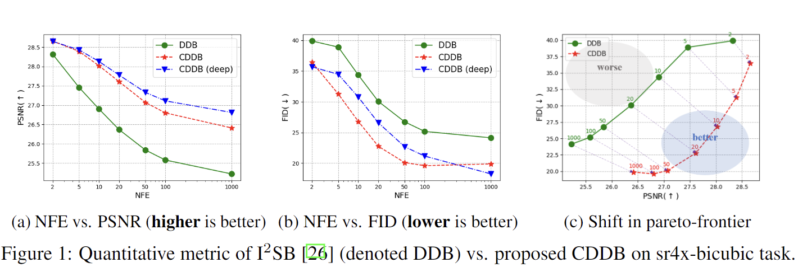

# Direct Diffusion Bridge using Data Consistency for Inverse Problems (NeurIPS 2023)



Official PyTorch implementation of the NeurIPS 2023 paper [Direct Diffusion Bridge using Data Consistency for Inverse Problems](https://arxiv.org/abs/2305.19809). Code modified from [I2SB](https://github.com/NVlabs/I2SB).

by [Hyungjin Chung](https://www.hj-chung.com/), [Jeongsol Kim](https://jeongsol.dev/), and [Jong Chul Ye](https://bispl.weebly.com/professor.html)

## Getting started

The pre-trained checkpoints and dependencies all follow [I2SB](https://github.com/NVlabs/I2SB). Please consult the original source. We list the steps to make the repository self-contained.

### Installation
```
conda env create --file requirements.yaml python=3
conda activate cddb
```

### pre-trained checkpoints
One can download the checkpoints by simply running
```
bash scripts/download_checkpoint.sh $DEG_NAME
```
In this work, we consider ```$DEG_NAME```: ```sr4x-pool, sr4x-bicubic, blur-uni, blur-gauss, jpeg-10```, but others can be used. One can also [manually](https://drive.google.com/drive/folders/1sgHF2FjgsAiV7doBeeOiBD8NyQhKutsG) download the model weights and place it under ```./results/{$DEG_NAME}```

## Running CDDB, CDDB-deep

Simply run
```
./scripts/sample.sh
```
Use ```use-cddb``` or ```use-cddb-deep``` flag to run either algorithm. When neither are used, DDB (I2SB) sampling will be performed.

Also, make sure that ```--dataset-dir``` specified matches the paths specified in ```./dataset/val_faster_imagefolder_10k_fn.txt``` and ```./dataset/val_Faster_imagefolder_10k_label.txt```. If not, modify the txt file.

## Citation

If you find this work interesting, please consider citing
```
@article{chung2023direct,
  title={Direct Diffusion Bridge using Data Consistency for Inverse Problems},
  author={Chung, Hyungjin and Kim, Jeongsol and Ye, Jong Chul},
  journal={Advances in Neural Information Processing Systems},
  year={2023}
}
```